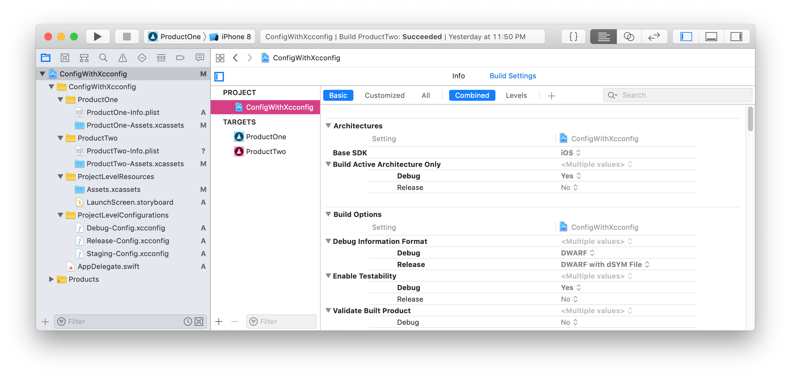
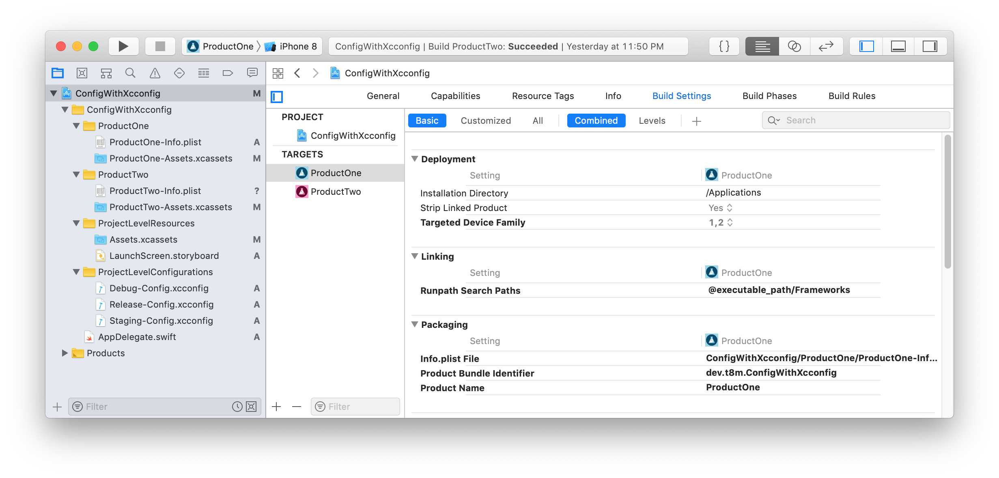
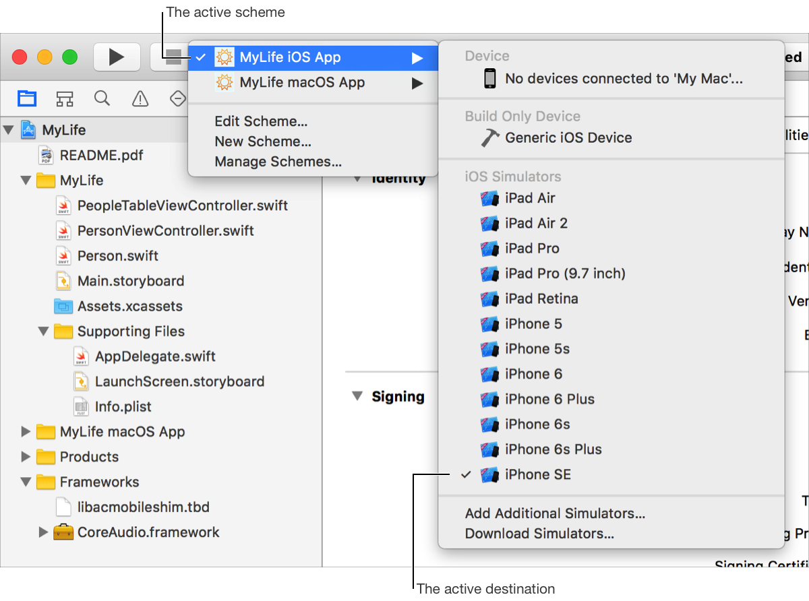

#  Introduce configuring targets and builds for an iOS application

_Written by: **Nguyen Minh Tam**_

**Menu**

- [Xcode Target](#xcode-target)
- [Xcode Project](#xcode-project)
- [Build Settings](#build-setting)
- [Xcode Scheme](#xcode-scheme)
- [Xcode Workspace](#xcode-workspace)

## Goal

At the end of the day, we will:

- Understand these Xcode concepts:
	- Xcode Target
	- Xcode Scheme
	- Xcode Workspace
	- Build Settings
- Know how to manage these concepts in Xcode.

Sounds interesting, right? Let's go! 🔫

## Xcode Target

- A target specifies a product to build and contains the instructions for building the product from a set of files in a project or workspace. 
	- The instructions for building a product take the form of build settings and build phases.
	- A target inherits the project build settings, but you can override any of the project settings by specifying different settings at the target level. (the project build settings will be mentioned right after this part)
	- There can be only one active target at a time; the Xcode scheme specifies the active target.
- A target defines a single product; it organizes the inputs into the build system—the source files and instructions for processing those source files—required to build that product. 
- Projects can contain one or more targets, each of which produces one product.
- You can see more about dependent target in official doc [here][Target]. To keep it simple, I introduce how to manage targets it in Xcode:

	

As you can see, we can adjust several settings for the targets in your project, such as:

- General settings: identity, signing, deployment info,...
- Capabilities settings.
- Resource tags settings.
- Info settings.
- Build settings.
- Build phases settings.
- Build rules settings.

You can find out more detail about what we can do with target in [this doc][Config]. Right now I am going to talk about Xcode project, which you saw in the Project navigator in the previous image.

## Xcode Project

- An Xcode project is a repository for all the files, resources, and information required to build one or more software products. It contains:
	- All the elements used to build your products and maintains the relationships between those elements. 
	- One or more targets. 
	- Default project build settings for all the targets in the project (each target can also specify its own build settings, which override the project build settings).

- An Xcode project file contains the following information:
	- References to source files:
		- Source code, Libraries and frameworks, Resource files, Image files, Groups used to organize the source files
		- Project-level build configurations. You can specify more than one build configuration for a project. For example: A project have debug and release build settings. We will see an example in [this project][ConfigWithXcconfig].
	- Targets.
	- The executable environments that can be used to debug or test the program. You can see more detail in this [official doc][Project].
- A project can stand alone or can be included in a workspace.
- Use Xcode schemes to specify which target, build configuration, and executable configuration is active at a given time. 

I will talk ablout Xcode scheme later in this section. Now, we go to what is build settings and what it does affect to the project and target level.

## Build Settings

- A build setting is a variable that contains information about how a particular aspect of a product’s build process should be performed.
- You can specify build settings at the project or target level. 
	- Each project-level build setting applies to all targets unless explicitly overridden by the build settings for a specific target.
	- Each target organizes the source files needed to build one product. A build configuration specifies a set of build settings used to build a target's product in a particular way. For example, it is common to have separate build configurations for debug and release builds of a product.

	

	
Project-level build setting: In **Project navigator**, choose **Project** > In project and targets list, choose **Project** > Choose **Build Settings**

	

Target-level (product-level) build setting: In **Project navigator**, choose **Project** > In project and targets list, choose **Target** > Choose **Build Settings**

- A build setting in Xcode has two parts: 
	- Setting title: identifies the build setting and can be used within other settings
	- Definition: is a constant or a formula Xcode uses to determine the value of the build setting at build time. Ex: display name, which is used to display the build setting in the Xcode UI.
- You can:
	- Create user-defined build settings for your project / target. 
	- Specify conditional build settings. The value of a conditional build setting depends on whether one or more prerequisites are met.

## Xcode Scheme

- An Xcode scheme defines a collection of targets to build, a configuration to use when building, and a collection of tests to execute.

- You can:
	- Define serveral schemes, but only one can be active at a time.
	- Specify whether a scheme should be stored in a project—in which case it’s available in every workspace that includes that project, or in the workspace—in which case it’s available only in that workspace.
	- When you select an active scheme, you also select a run destination (iPhone8 / ...).

	

## Xcode Workspace

- A workspace is an Xcode document that groups projects and other documents so you can work on them together. 
- To organizing all the files in each Xcode project, a workspace provides implicit and explicit relationships among the included projects and their targets.
- You can use the workspace’s default build directory or you can specify one. Note that if a project specifies a build directory, that directory is overridden by the build directory of whatever workspace the project is in at the time you build the project.

This is the end of Xcode concept introduction. Now we understand these concepts and how to interact with them in Xcode basically. In the next part of document, I will go to details about how to configure those things. But I do recommend you to take a look at this demo about [Configure targets and builds for an iOS application with *.xcconfig][ConfigWithXcconfig] before going to [Configure targets and builds for an iOS application][Config] because it is similar to what we would do in real project!

**Related topics:**

- Go back to [Manage Targets - Schemes in an iOS Project][ProjectTargetScheme].
- [Configure targets and builds for an iOS application][Config]
- [Configure targets and builds for an iOS application with *.xcconfig][ConfigWithXcconfig]
- How to use Settings.bundle in iOS Project. [See detail][Settings].

**Reference:**

- [x] [Xcode Concepts][Workspace]
- [ ] [Xcode Help][Help]

---

[ProjectTargetScheme]: https://github.com/nmint8m/projecttargetscheme
[Introduce]: ./01-Introduce.md
[Config]: ./02-Config.md
[ConfigWithXcconfig]: ./03-ConfigWithXcconfig.md
[Settings]: https://github.com/nmint8m/settingsbundle

[Target]: https://developer.apple.com/library/archive/featuredarticles/XcodeConcepts/Concept-Targets.html
[Project]: https://developer.apple.com/library/archive/featuredarticles/XcodeConcepts/Concept-Projects.html
[BuildSetting]: https://developer.apple.com/library/archive/featuredarticles/XcodeConcepts/Concept-Build_Settings.html
[Workspace]: https://developer.apple.com/library/archive/featuredarticles/XcodeConcepts/Concept-Workspace.html
[Scheme]: https://developer.apple.com/library/archive/featuredarticles/XcodeConcepts/Concept-Schemes.html

[Help]: https://help.apple.com/xcode/mac/current/