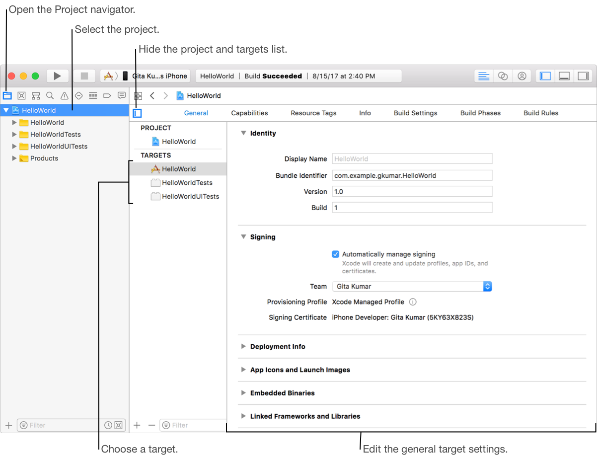

#  Introduce configuring targets and builds for an iOS application

_Written by: **Nguyen Minh Tam**_

**Menu**

## Goal

At the end of the day, we will:

- Understand these Xcode concepts:
	- Xcode Target
	- Xcode Scheme
	- Xcode Workspace
	- Build Settings
- Know how to manage these concepts in Xcode.

Sounds interesting, right? Let's go! 🔫

## Xcode Target

- A target specifies a product to build and contains the instructions for building the product from a set of files in a project or workspace. 
	- The instructions for building a product take the form of build settings and build phases.
	- A target inherits the project build settings, but you can override any of the project settings by specifying different settings at the target level. (the project build settings will be mentioned right after this part)
	- There can be only one active target at a time; the Xcode scheme specifies the active target.
- A target defines a single product; it organizes the inputs into the build system—the source files and instructions for processing those source files—required to build that product. 
- Projects can contain one or more targets, each of which produces one product.
- You can see more about dependent target in official doc [here][Target]. To keep it simple, I introduce how to manage targets it in Xcode:

	

As you can see, we can adjust several settings for the targets in your project, such as:

- General settings: identity, signing, deployment info,...
- Capabilities settings.
- Resource tags settings.
- Info settings.
- Build settings.
- Build phases settings.
- Build rules settings.

You can find out more detail about what we can do with target in [this doc][Config]. Right now I am going to talk about Xcode project, which you saw in the Project navigator in the previous image.
