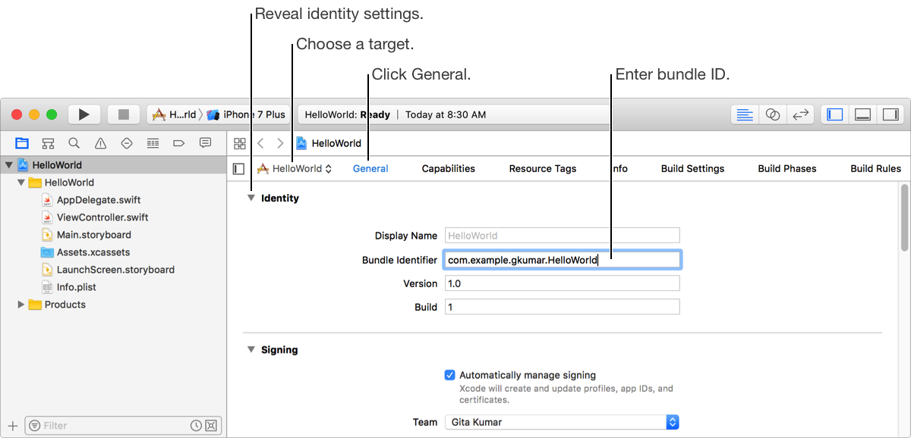
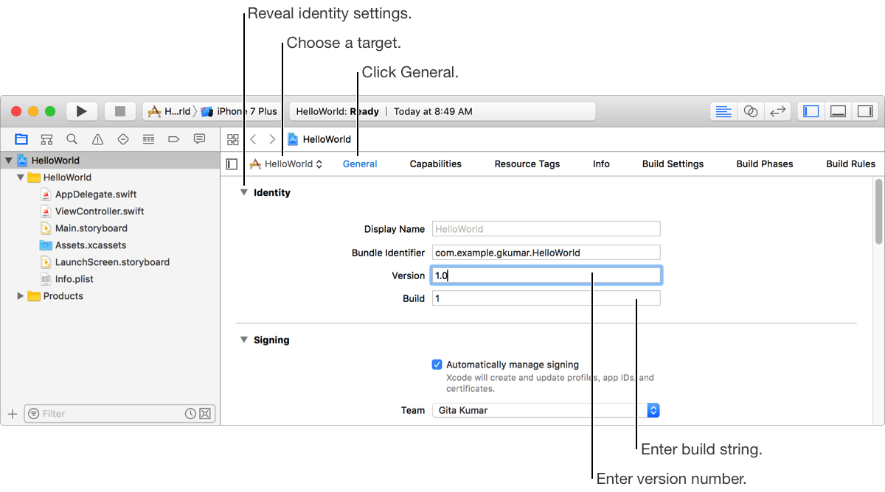
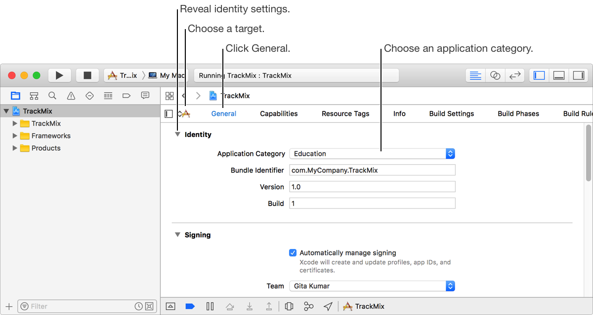
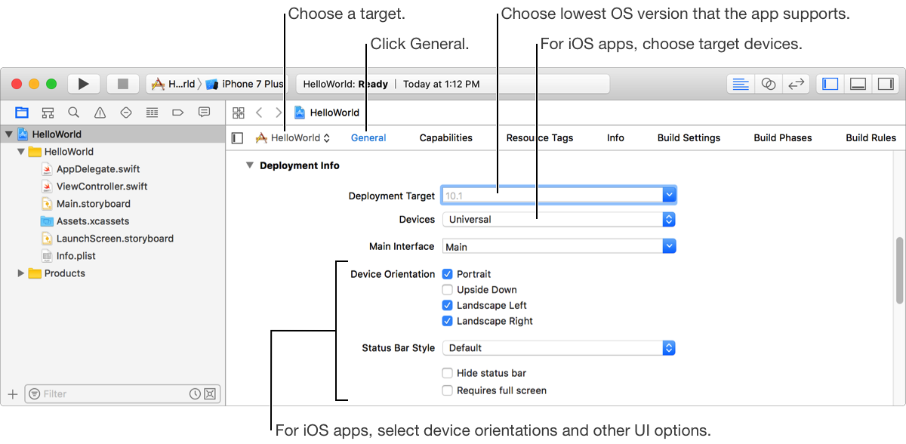
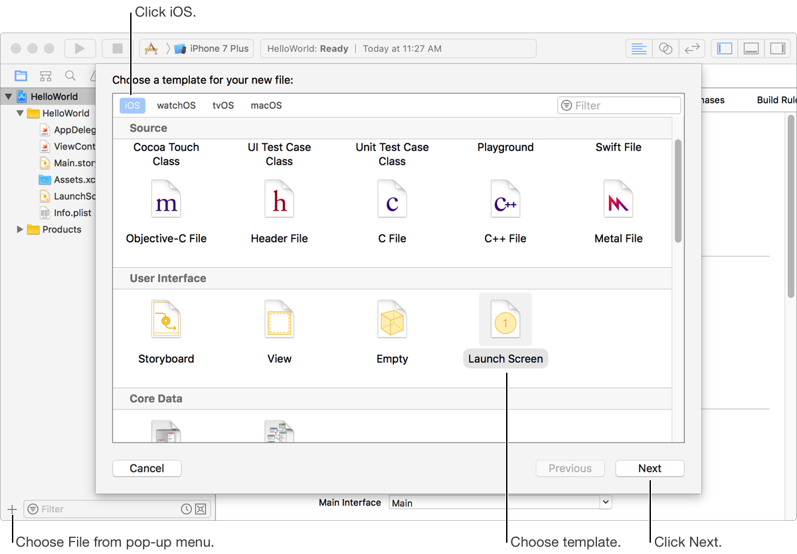
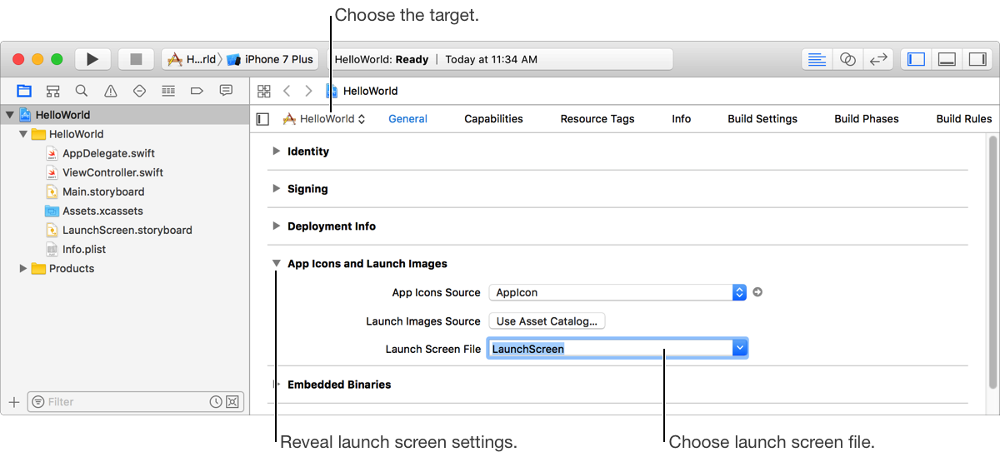
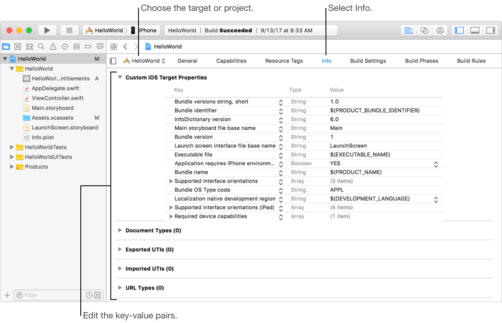
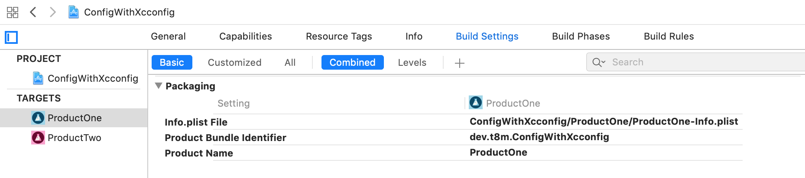

#  Configure targets and builds for an iOS application

_Written by: **Nguyen Minh Tam**_

**Menu**

- [Xcode Target](#xcode-target)
	- Edit general settings
	- Edit Info settings
	- Edit build settings
	- Configure build phases
	- Configure capabilities
- [Xcode Project](#xcode-project)
- [Build Settings](#build-setting)
- [Xcode Scheme](#xcode-scheme)
- [Xcode Workspace](#xcode-workspace)

## Goal

Same as [previous section's goal][Introduce], but now I want to dive deep down into how to manage them. Besides, I also want to introduce how file `*.plist` and `*.xcconfig` work in this section. Let's go! 🔫

## Xcode Target

- A target specifies a product to build and contains the instructions for building the product from a set of files in a project or workspace. 
- This is how we manage targets in Xcode:

	

We can adjust these settings for the targets in your project:

- Edit general settings
- Edit Info settings
- Edit build settings
- Configure build phases
- Configure capabilities

### Edit general settings

What we can do in general settings:
- Edit identity settings
- Edit signing settings
- Edit deployment info settings
- Create a launch screen (iOS)

#### Edit identity settings

- **Set the bundle ID:**
	- Set the bundle ID before you add capabilities to your app and before you upload or export your app.
	- The bundle ID in the Xcode project must match the bundle ID in App Store Connect. If you previously [uploaded your app to App Store Connect](https://help.apple.com/xcode/mac/current/#/dev442d7f2ca), you can no longer change the bundle ID in App Store Connect.

	

- **Set the version number and build string:**
	- It’s important to initially set, and later update, the version number and build string before you upload or export your app because:
		- Used throughout the system to identify the build. 
		- Used to identify crash reports and dSYM files for apps distributed through TestFlight or the App Store. For iOS apps, iTunes will recognize and sync the new app version to the device.
	- Therefore:
		- Set them before creating first archive. 
		- Increment the build string before archiving a new build of the app that you intend to upload to App Store Connect or export for distribution outside the App Store. 
		- Increment the version number when you create a new app version in App Store Connect.

	

- **Set the app category (macOS):** The category will be listed on the Mac App Store and the categogy you selected should match the category you later select in App Store Connect.

	

#### Edit signing settings

- **Assign a project to a team:**

	

- **Manually sign an app:** 
	- It includes these steps:
		- Enable manual signing.
		- Download a provisioning profile
		- Import a provisioning profile
		- View provisioning profile details
	- This is an important part when config project, I just want to keep everything simple in the demo example by assigning project to personal team. So I recommend seeing detail in this [official doc](https://help.apple.com/xcode/mac/current/#/dev1bf96f17e).

#### Edit deployment info settings

- The deployment target specifies the lowest operating system version that can run your app
- The target devices specifies devices are builded iPhone, iPad, or Universal (to target both types of devices).
- The device orientations and other UI options (for iOS, watchOS).
- Set the user interface style (for tvOS).

	

#### Create a launch screen (for iOS)

	

In the next sheet, choose a location and enter a filename. Select the target that you want to add the file to.

This target is related to the Xcode target I mentioned in the [previous section][Introduce]. If you create 2 files with the same name and in diffent directories, you can Set the launch screen file with the same file name, but when building into products, it presents different file, depends on the target we choose to build.

	

### Edit Info settings

#### Edit the information property list

The information property list (the Info.plist file in your project) contains key-value pairs that configure your project or target. You can edit these settings on the Info pane for the project or target, or by editing the Info.plist file directly.

	

Please note that:

- The Info.plist should be defined the explicit target.
- The path linking to Infor.plist file in target is defined in tab Build Settings:

	

To edit the Info.plist file directly, Control-click it in the Project navigator and choose Open As > Source Code or Open As > Property List.

#### Add export compliance keys

See more in this [official doc](https://help.apple.com/xcode/mac/current/#/dev0dc15d044).

#### Set the copyright key (macOS)

See more in this [official doc](https://help.apple.com/xcode/mac/current/#/dev0dc15d044).

#### Set supported document types (iOS, macOS)

See more in this [official doc](https://help.apple.com/xcode/mac/current/#/devddd273fdd).
