##  Configure targets and builds for an iOS application with *`.xcconfig`

_Written by: **Nguyen Minh Tam**_

### Goal

Use knowlege in previous parts: [here][Introduce] and [here][Config] to configure an iOS project with multiple targets and schemes. Use `*`.xcconfig`` and `.plist` files to do so.

Let's go! 🔫

### Getting started

**Use case**

During the development lifecycle of a software project, you probably create different builds at various stages:

- Developing
- Staging
- Product

For example, in the developing stage, it is suitable to use developing stage's configurations, such as: Base URL for developing stage is `http://dev.somehost.com/`. In developing stage, the developing build version will be utilized by your QA group to test the features and bug fixes.

And when the app passes all tests and got the QA team’s approval, you will create another version which is sent to your customers for beta test before pushing it to App Store. I call this stage is staging. Congigurations will be definitely different when going to the staging stage. Now the base URL changes to `http://stg.somehost.com/`.

At the last, once client is satisfied with the staging build version, we will deploy the application with product configuration. Now the base URL of application is turned into `http://somehost.com/`.

As we can see that all of these builds are not exactly the same, each of which usually has some specialties and a slightly different configuration.

For another example, we should define different application name for each build to distinguish them. For example:

- `[Dev]-AppName` for developing build
- `[Stg]-AppName` for staging build
- `AppName` for product build

### How Can You Manage Multiple Builds?

I will talk about some ways that we can manage multiple builds inside one project.

- Firstly, creating different targets, each one of which owns different `Info.plist`. Each time a target is selected, a different `Info.plist` will be used, hence we will be able to differentiate variables like token, URLs for different builds.

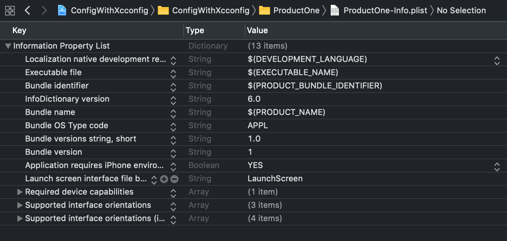

- Second way: Using [Preprocessor macros][PreprocessorMacros] will control the conditional compilation of various chunks of code.

	- For example: The DEBUG preprocessor macro in below example acts like a switch that you can use to turn on or off different sections of your code. We can define similar 

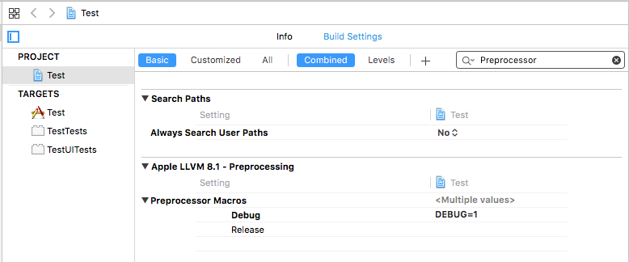

```swift
#if DEBUG
print("Error!")
#else
fatalError("Error!")
#endif
```

- Third way: Putting build configuration settings into `.xcconfig` files and refer those in your project info. Then we can build different builds by just changing the scheme. Putting build configuration settings into files is more convenience than the two ways above.

So in this demo, I will manage several builds by using the third way.

### What we will do?

We should archive those requiremts:

| Requirement | App T8mTeacher | App T8mStudent|
| --- | --- | --- |
| App icon |  |  |
| App name for developing stage | [DEV] T8mTeacher | [DEV] T8mStudent |
| App name for staging stage | [STG] T8mTeacher | [STG] T8mStudent |
| App name for product stage | T8mTeacher | T8mStudent |
| Base URL for developing stage | https://dev.teacher.t8m.dev | https://dev.student.t8m.dev |
| Base URL for staging stage | https://stg.teacher.t8m.dev | https://stg.student.t8m.dev |
| Base URL for product stage | https://teacher.t8m.dev | https://student.t8m.dev |

So, the first things we do to archive those requirement are:

- Creating 2 targets: T8mTeacher & T8mStudent
- Creating 3 schemes: DEV, STG, PRO for each target

### Creating targets

There are two steps here:

- Firstly, creating two targets.
- Secondly, configuring file `Info.plist` for each target.

#### 1. Creating two targets

Duplicating default target and we get:

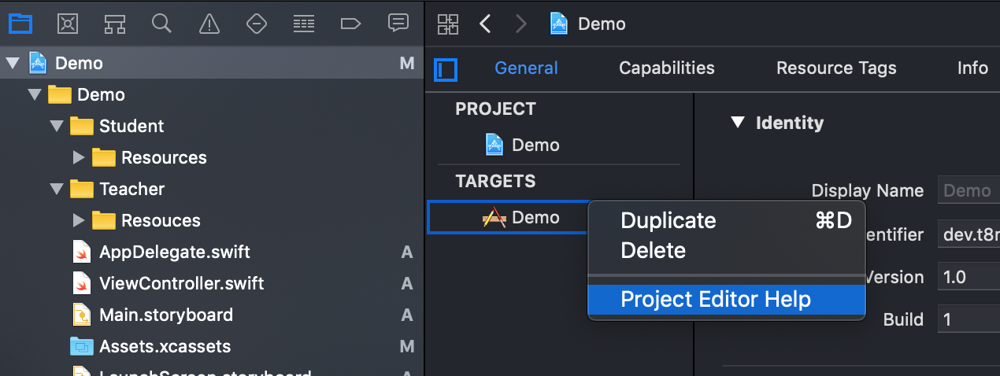

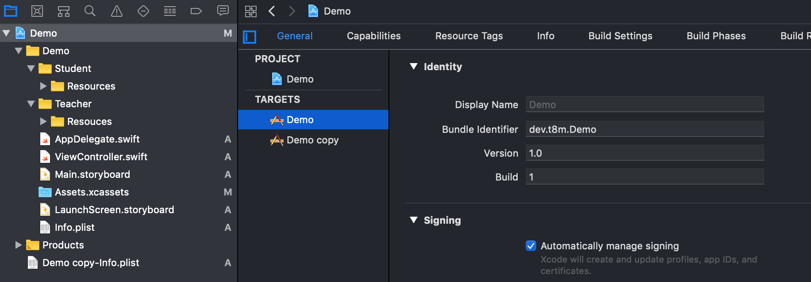

Rename targets; `Info.plist` files and move them into the suitable folder.

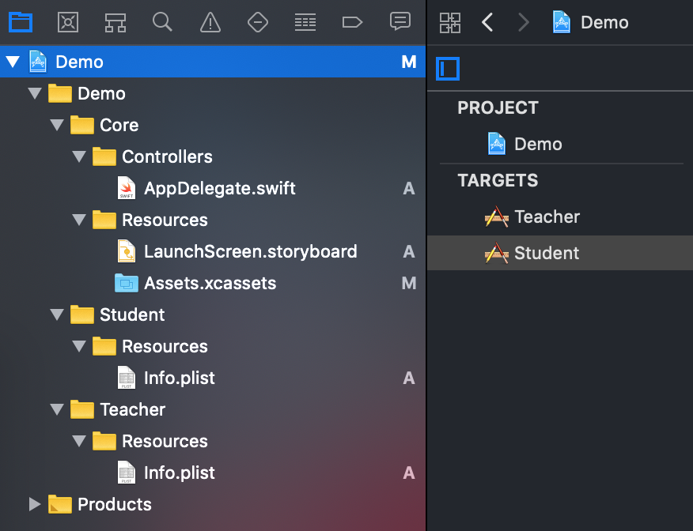

#### 2. Configuring file `Info.plist` for each target

Edit the path of file Info.plist for each target. Remember to refer to the right directory:

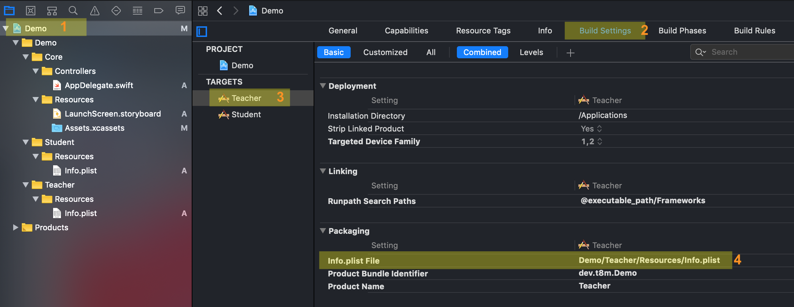

To check whether you refer to the right folder, check in tab `Info`, if tab Info is like below, it means we refered to the wrong folder or that `*.plist` was not set the target:

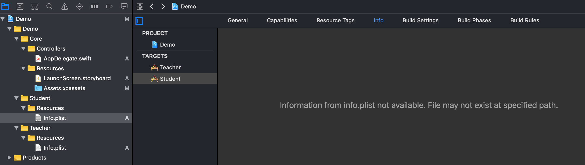

Set target for `Info.plist` file by doing this:

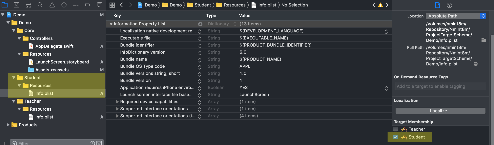

> NOTE: Wrong folder means the wrong physical folder not the reference folder.

### Create Build Configuration and Schemes

Select file Project in Project Navigator > Select Project > Choose tab Info > you should see that Xcode already provides you two different configuration levels: Debug and Release.

Delete the Debug scheme and duplicate the Release scheme then rename them:

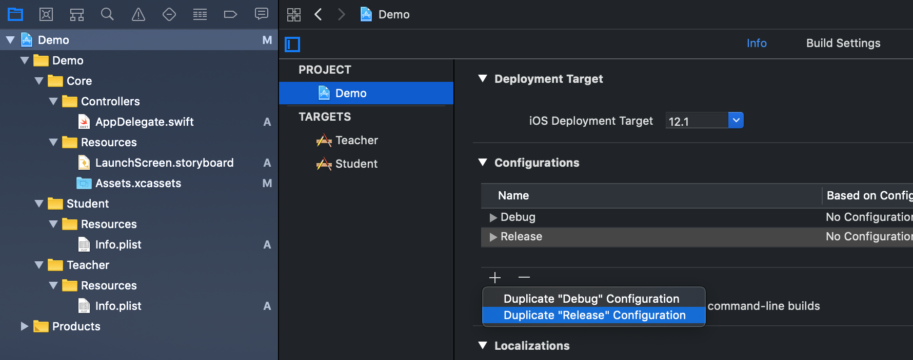

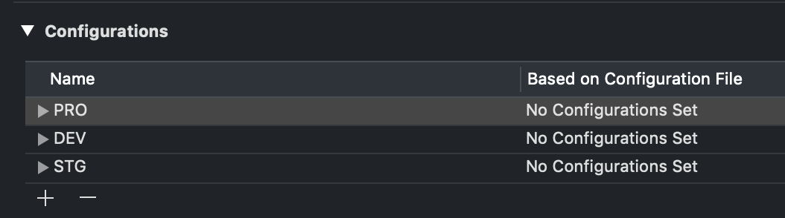

Now we are going to create a new configuration. Let’s just call it “Staging”. Click on the + sign right beneath the configuration list and select “Duplicate Debug configuration” as it’s much easier to remove the things we don’t want from the Debug configuration than putting back in those we need to the Release configuration.

Choose Manage Schemes... > Delete all current schemes and add new.

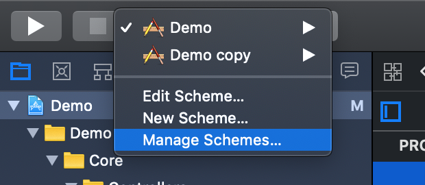

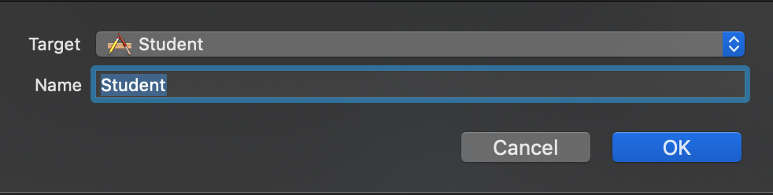

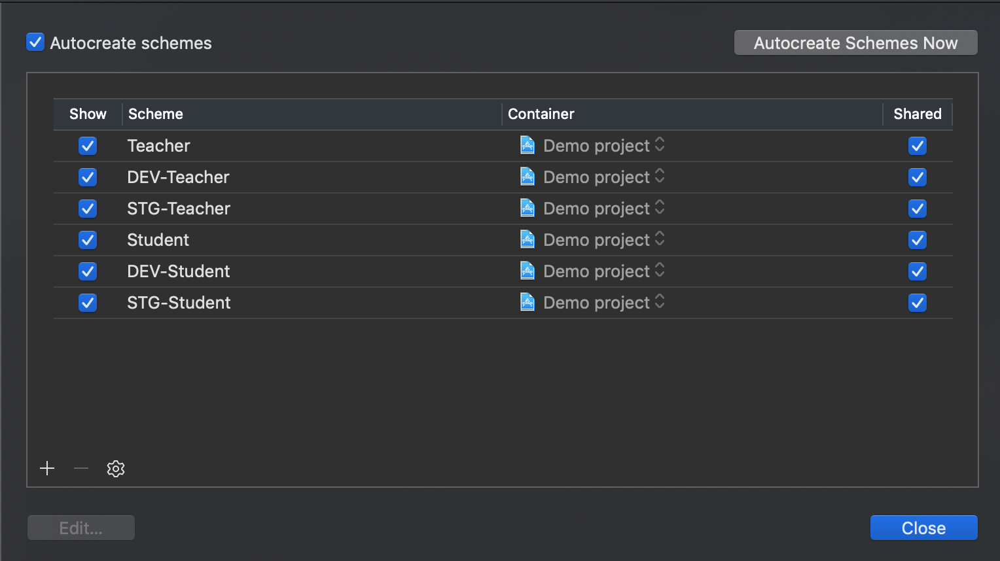

The next time, if you want to change build configurating in build scheme:

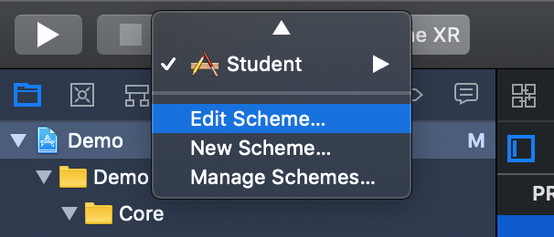

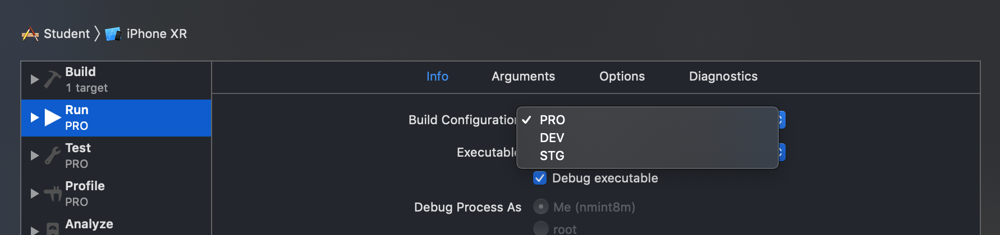

### Using Xcode Configuration File (`.xcconfig`)

As mentioned we use Xcode configuration file (`.xcconfig`) instead of using conditional compilation blocks to manage the build settings (such as which tokens, api keys, urls of backends should be used).

Xcode Configuration file (`.xcconfig`) is, it is actually a key/value based file. You can store your build settings in the form of key/value pairs, similar to what you did in dictionaries. By using a `.xcconfig` file, it is very easy to define build parameters for each build.

Create a `.xcconfig` file. In the project navigator, right click the project folder and chooose New file…. In the dialog that pops up, select the Configurations Settings File. 

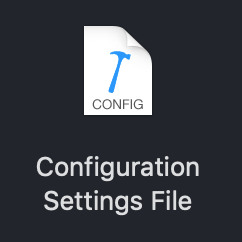

Make sure the targets checkboxes are all unchecked, because you don’t want to include this in your app’s bundle.

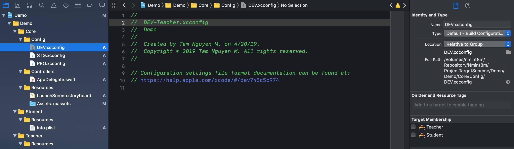

Now go to your project’s info screen and set the configuration files for each build configuration.

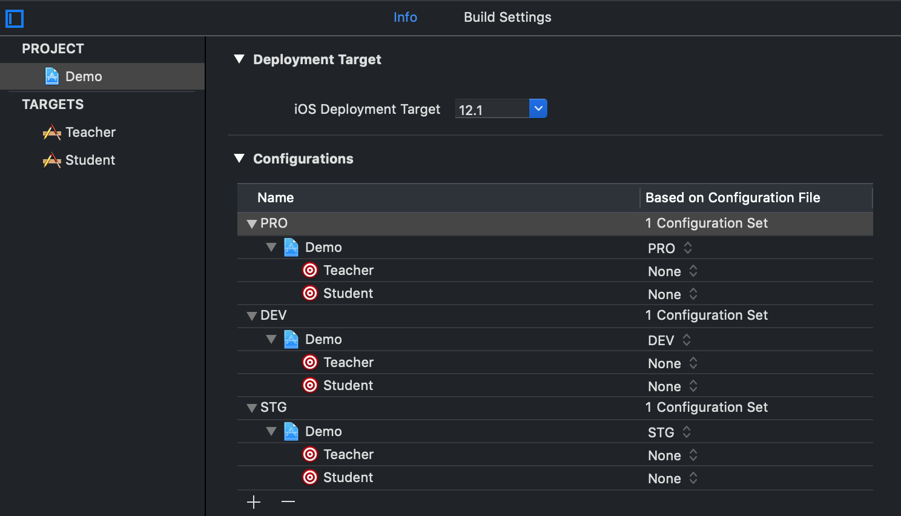

### Changing the Build Information

You want to change the build information like app name, app version, bundle identifier, and bundle version for each build, you can edit each of the `.xcconfig` file like this:

`DEV.xcconfig`:

```
APP_NAME = [DEV]-$(TARGET_NAME)
APP_VERSION = 1.0
APP_BUNDLE_ID = dev.t8m.demo.$(TARGET_NAME).dev
```

`STG.scconfig`:

```
APP_NAME = [STG]-$(TARGET_NAME)
APP_VERSION = 2.0
APP_BUNDLE_ID = dev.t8m.demo.$(TARGET_NAME).stg
```

`PRO.xcconfig`:

```
APP_NAME = $(TARGET_NAME)
APP_VERSION = 3.0
APP_BUNDLE_ID = dev.t8m.demo.$(TARGET_NAME)
```

Use your configuration variables in project settings, `Info.plist` and entitlement files.

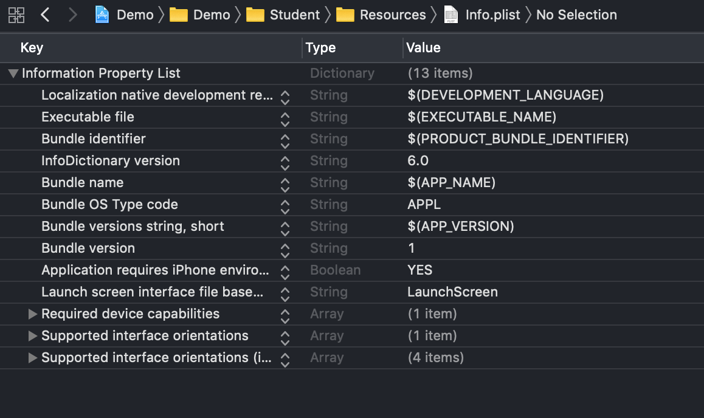

Change the Bundle Indentifier:

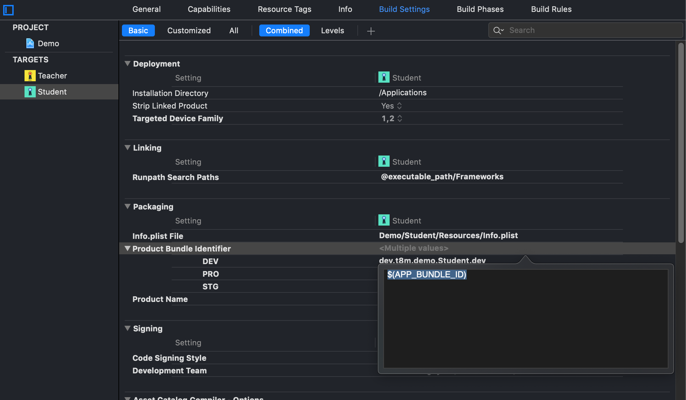

Do not include Info.plist in Build Phases:

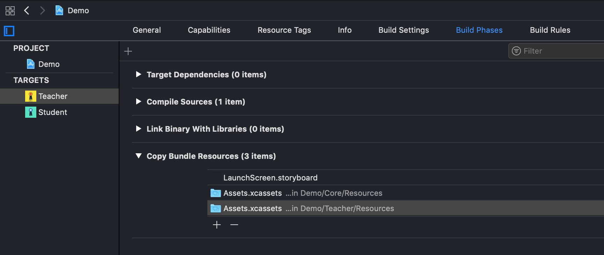

So, let's build our app with different configurations by editing schemes.

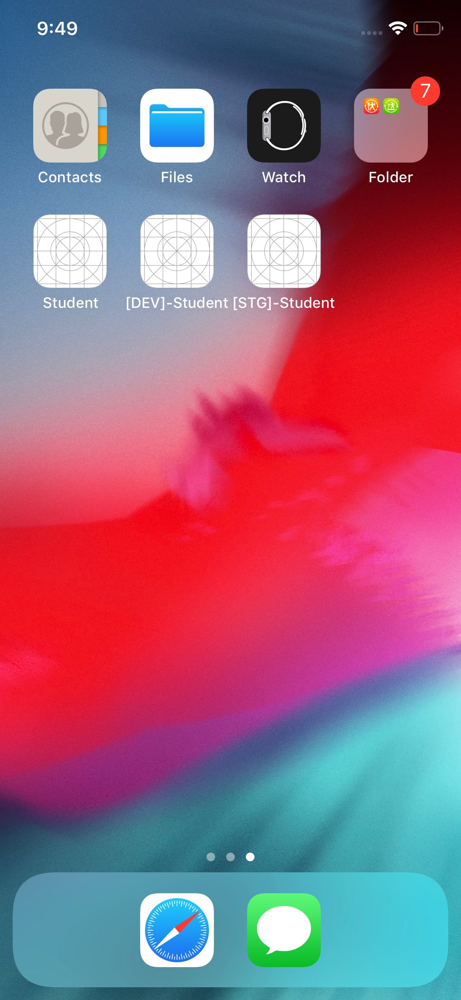

> Note: Changing the bundle identifier will require you to create more provisioning profiles.

### Changing App Icon

Do similarly:

In `*.xcconfig` files, define different app icon name:

```
APP_ICON = AppIcon // for PRO.xcconfig
APP_ICON = AppIcon-DEV // for DEV.xcconfig
APP_ICON = AppIcon-STG // for STG.xcconfig
```
Create Assets.asset for each target:

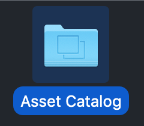
<br>
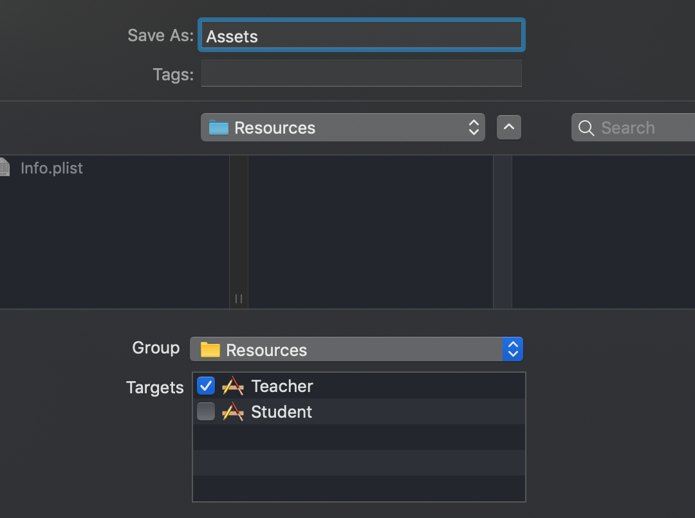
<br>
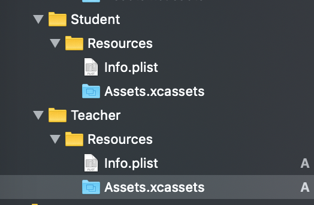
<br>
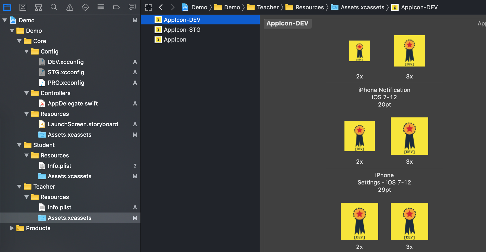

Change app icon property in Info:

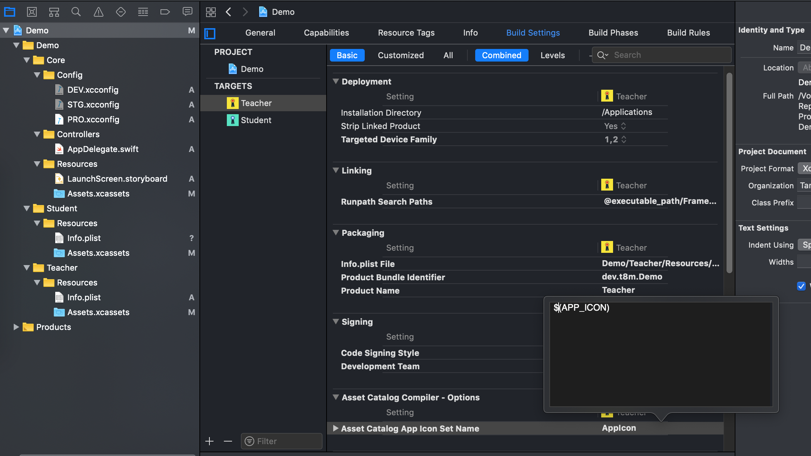
<br>
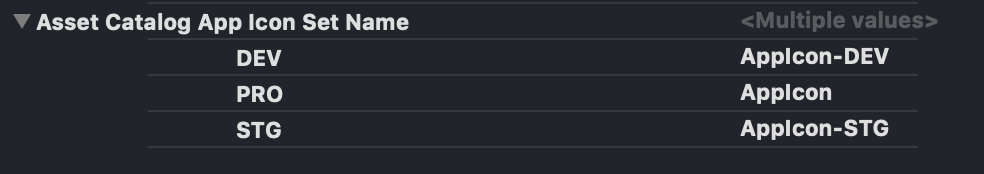

Run app:

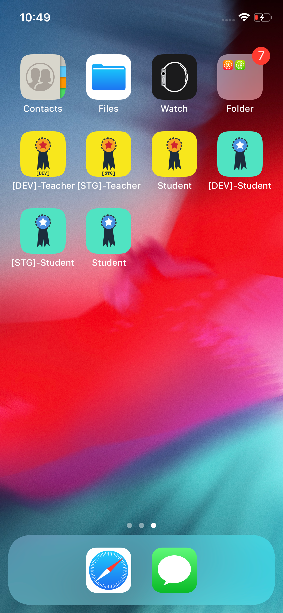

### Accessing Variables from Code

Add variables to `Info.plist` by creating additional fields

```
func infoForKey(_ key: String) -> String? {
        return (Bundle.main.infoDictionary?[key] as? String)?
            .replacingOccurrences(of: "\\", with: "")
 }
```

### Switching Between Build Configurations

To switch between build configurations, you can simply change the scheme by holding the option key and click on the scheme at the top. You can then select your preferred build configuration.

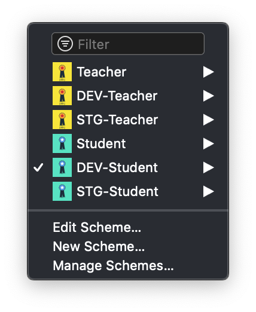

**Related topics:**

- Go back to [Manage Targets - Schemes in an iOS Project][ProjectTargetScheme].
- [Introduce configuring targets and builds for an iOS application][Introduce]
- [Configure targets and builds for an iOS application][Config]
- How to use Settings.bundle in iOS Project. [See detail][Settings].

**Reference:**

- [x] [Xcode Concepts][Workspace]
- [ ] [Xcode Help][Help]
- [ ] [Information Property List Key Reference][InfoPlist]
- [ ] [Configuration Settings File (xcconfig) format][ConfigurationSettingsFile]

---

[ProjectTargetScheme]: https://github.com/nmint8m/projecttargetscheme
[Introduce]: ./01-Introduce.md
[Config]: ./02-Config.md
[ConfigWithXcconfig]: ./03-ConfigWithXcconfig.md
[Settings]: https://github.com/nmint8m/settingsbundle
[InfoPlist]: https://developer.apple.com/documentation/bundleresources/information_property_list

[PreprocessorMacros]: https://developer.apple.com/library/archive/technotes/tn2347/_index.html#//apple_ref/doc/uid/DTS40014516-CH1-THE_DEBUG_PREPROCESSOR_MACRO
[Target]: https://developer.apple.com/library/archive/featuredarticles/XcodeConcepts/Concept-Targets.html
[Project]: https://developer.apple.com/library/archive/featuredarticles/XcodeConcepts/Concept-Projects.html
[BuildSetting]: https://developer.apple.com/library/archive/featuredarticles/XcodeConcepts/Concept-Build_Settings.html
[Workspace]: https://developer.apple.com/library/archive/featuredarticles/XcodeConcepts/Concept-Workspace.html
[Scheme]: https://developer.apple.com/library/archive/featuredarticles/XcodeConcepts/Concept-Schemes.html

[Help]: https://help.apple.com/xcode/mac/current/
[ConfigurationSettingsFile]: https://help.apple.com/xcode/mac/current/#/dev745c5c974