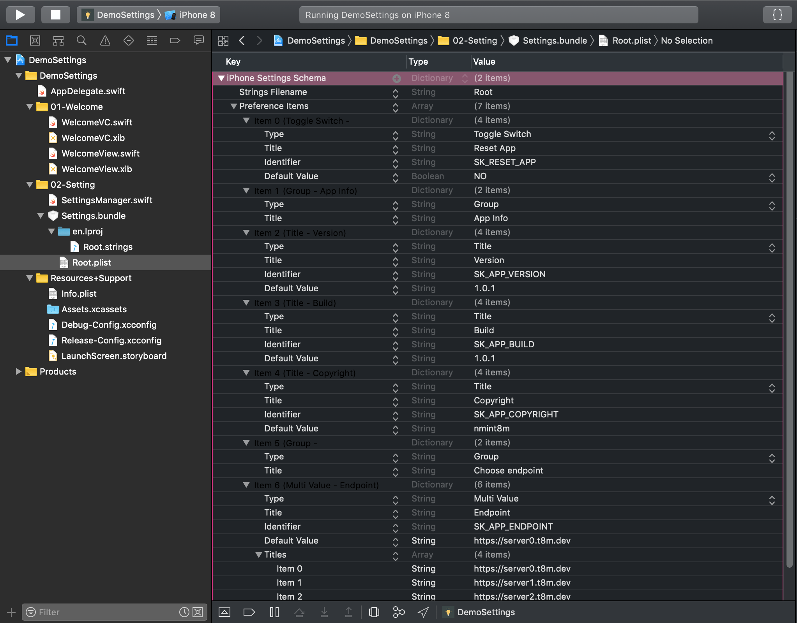
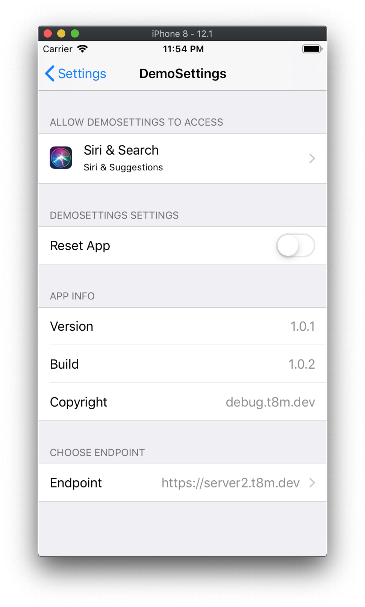
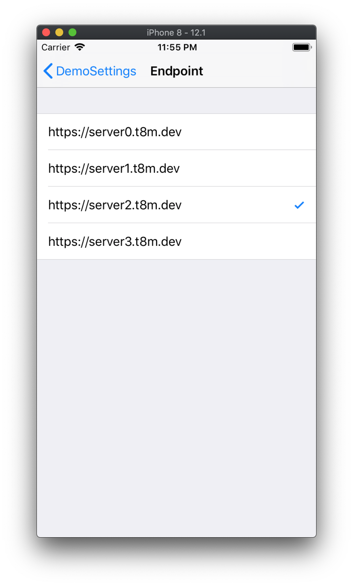
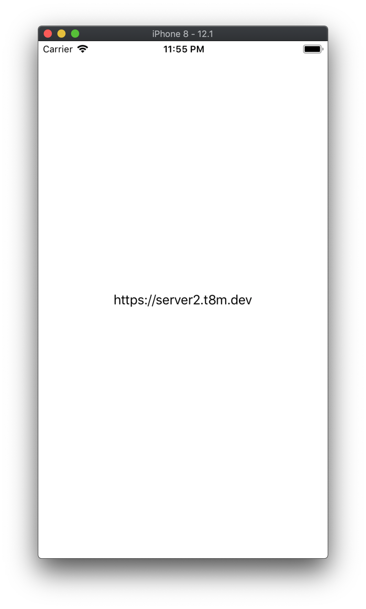

# Demo Set Up Project With Multiple Target

**Menu**

- [Demo Xcode “Targets” with multiple build configurations](#demo-xcode-targets-with-multiple-build-configurations)
- [Using Xcode Configuration File (.xcconfig) to Manage Different Build Settings](#using-xcode-configuration-file-xcconfig-to-manage-different-build-settings)
- [Adding settings to your iOS app](#adding-settings-to-your-ios-app)

## Demo Xcode “Targets” with multiple build configurations

Open `DemoConfigUserDefined/DemoConfigUserDefined.xcodeproj` for detail.

How to create multiple applications that differentiate and share parts of the source code.

### Why do I need this?

- Build one version of your app for iPhone and another specific version for iPad, need to share some part of your code and customize others things: screen layout, presentation behaviors
- Big company that has some independent business units and desires to build just one app for these companies, some business rules can be different for each business unit.

### How can I achieve this goal?

> A target specifies a product to build and contains the instructions for building the product from a set of files in a project or workspace.
 
with a Target, there are many default configurations, in this case when you duplicate a Target, you are making a clone of it. After that, you can change bundle identifier, deployment info, display name, app icons source, and so on. 

So, another powerful thing that a Target provides is the possibility to create a resource with the same name for each Target you have. Notice in the picture above, the project has two files declaring a class called Product, in a normal situation it will produce a compilation error, but using Target, you can assign each file to a specific Target. Look at the image below, you select the file and define the Target.

### A common mistake

When you are working with Target it is very common to create a resource and forget to assign more than one Target, later when you try to compile, you get an error saying that that resource does not exist, so you look in the source code tree and file is there, but it is not been included in the selected target, believe me, I already spent some minutes trying to understand what was wrong.

### Step by step

Create new / duplicate target no transfer iPad.

Rename first target and second target: ONE, TWO.

Config each target: In target ONE, going to Build Setting:

- Change path of Info.plist file, Product Bundle Identifier.

```
Info.plist File: DemoConfigUserDefined/ONE/Supports/Info.plist
Product Bundle Identifier: dev.t8m.one
```

- Add a User-defined Setting with this dictionary. Do similarly for target TWO and check the property `Info.plist File` is the same path as ProductOne.
	
```
ENPOINT_URL
Debug: http://debug.productone.nmint8m.dev
Release: http://productone.nmint8m.dev
```

- In file `DemoConfigUserDefined/ONE/Supports/Info.plist` create a property:

```
ENPOINT_URL: $(ENDPOINT_URL)
```

- Config scheme for ProductTwo -> target ProductTwo

- The last step, get the property:

```
class Config {
    static var endpoint: String {
        get {
            guard let path = Bundle.main.path(forResource: "Info", ofType: "plist"),
                let dic = NSDictionary(contentsOfFile: path),
                let endpoint = dic["ENDPOINT_URL"] as? String else { return "" }
            return endpoint
        }
    }
}
```

When we build with target:

- ProductOne -> print `debug.productone.t8m.dev`
- ProductTwo -> print `debug.producttwo.t8m.dev`

**Reference:**
> [Xcode “Targets” with multiple build configurations](https://medium.com/@andersongusmao/xcode-targets-with-multiples-build-configuration-90a575ddc687)

### AppIcon for each target

- Create file *.xassets for each target
- Import AppIcon
- Choose target in project, set AppIcon in General.

### Change Bundle Indentifier

- Change Bundle Identifier for each target

### Some Notes on Managing Multiple Targets

1. When you add new files to the project, don’t forget to select both targets to keep your code in sync in both builds.
2. In case you’re using Cocoapods, don’t forget to add the new target to your podfile. You can use link_with to specify multiple targets. You can further consult the Cocoapods documentation for details. Your podfile should look something like this:

```bash
source 'https://github.com/CocoaPods/Specs.git'
platform :ios, '7.0'
workspace 'todo'
link_with 'todo', 'todo Dev'
pod 'Mixpanel'
pod 'AFNetworking'
source 'https://github.com/CocoaPods/Specs.git'
platform :ios, '7.0'
workspace 'todo'
link_with 'todo', 'todo Dev'
pod 'Mixpanel'
pod 'AFNetworking'
```

3. If you use continuous integration system such as Travis CI or Jenkins, don’t forget to configure to build and deliver both targets.

**Reference:**
> [How to Use Xcode Targets to Manage Development and Production Builds](https://www.appcoda.com/using-xcode-targets)

## Using Xcode Configuration File (.xcconfig) to Manage Different Build Settings

During the development lifecycle of a software project, you probably create different builds at various stages. At the early stage, there will be the one that conforms to your local configuration. When you are ready to move to the next stage, there is another build that will be utilized by your QA group to test the features and bug fixes. When the app passes all tests and got the QA team’s approval, you will create another version which is sent to your customers for beta test before pushing it to App Store. At last, there will be the production-ready application, once the client is satisfied with the build that you have sent. All of these builds are not exactly the same, each of which usually has some specialties and a slightly different configuration.

For example, if the app needs to connect to a backend, it is very likely the app is connected to the test environment during QA tests. The build is probably configured with a test URL. When you move to the next stage, the other build will have another URL for connecting to the staging/production server. On top of that, you may not be showing the same level of information when an error occurs in the application for all the builds.

### How Can You Manage Multiple Builds?

First way: Create different targets, each one of which employs different Info.plist. Each time a target is selected, a different Info.plist will be used, hence we will be able to differentiate variables like token, URLs for different builds.

Second way: Using Bundle Identifiers. Defining different preprocessor macros will control the conditional compilation of various chunks of code.

Third way: put your build configuration settings into .xcconfig files and refer those in your project info. Then you can build a different version of an app by simply changing the scheme. Putting build configuration settings into files is a huge win for configuration management.

### Creating the Build Configuration

Select file Project in Project Navigator > Select Project > Choose tab Info > you should see that Xcode already provides you two different configuration levels: Debug and Release.

Now we are going to create a new configuration. Let’s just call it “Staging”. Click on the + sign right beneath the configuration list and select “Duplicate Debug configuration” as it’s much easier to remove the things we don’t want from the Debug configuration than putting back in those we need to the Release configuration.

### Using Xcode Configuration File (.xcconfig)

As mentioned we use Xcode configuration file (.xcconfig) instead of using conditional compilation blocks to manage the build settings (such as which tokens, api keys, urls of backends should be used).

Xcode Configuration file (.xcconfig) is, it is actually a key/value based file. You can store your build settings in the form of key/value pairs, similar to what you did in dictionaries. By using a .xcconfig file, it is very easy to define build parameters for each build. You will understand what I mean in a while.

Create a .xcconfig file. In the project navigator, right click the project folder and chooose New file…. In the dialog that pops up, select the Configurations Settings File. In the next screen, give it the name “Staging” and make sure the targets checkboxes are all unchecked, because you don’t want to include this in your app’s bundle.

Now go to your project’s info screen, under the configurations section expand the list and select the xcconfile “Staging” from the drop down box.

Once done, you can repeat the process for the main target and choose the Debug file. Also, repeat the process for the Release Target.

### Changing the Build Information

You want to change the build information like app name, app version, bundle identifier, and bundle version for each build, you can edit each of the .xcconfig file like this:

```
Debug.xcconfig:

IS_APP_NAME = Donate Debug
IS_APP_VERSION = 0.3
IS_APP_BUNDLE_ID = com.intensifystudio.DonateDebug
```

Use your configuration variables in project settings, info.plist and entitlement files.

```
Bundle name: $(IS_APP_NAME)
```

For clarity, I am using a custom prefix “IS” for IntensifyStudio as the name of my little development studio to distguish the custom key from the default one.

> Note: Changing the bundle identifier will require you to create more provisioning profiles.

### Changing App Icon

Go to Build Settings and replace AppIcon with the variable ${IS_APP_ICON}

### Accessing Variables from Code

Add variables to Info.plist by creating additional fields

```
func infoForKey(_ key: String) -> String? {
        return (Bundle.main.infoDictionary?[key] as? String)?
            .replacingOccurrences(of: "\\", with: "")
 }
```

### Switching Between Build Configurations

To switch between build configurations, you can simply change the scheme by holding the option key and click on the scheme at the top. You can then select your preferred build configuration.

**Reference:**
> [Using Xcode Configuration File (.xcconfig) to Manage Different Build Settings](https://www.appcoda.com/xcconfig-guide/)

## Adding settings to your iOS app

> Normally all my apps used to have login and logout option. So , to reset the app data I just had to click on logout button and it will call a routine function which will clear all the database data and userdefaults data. But, in one of the apps that I have made recently, I wanted to reset the app data once in a while. But the saddest part is that it didn’t had a login/logout option. Also, I didn’t want to add any button from inside the app to clear the data. This app had facebook and google subscription button in two different places inside the app which will go away once the subscription is successful. So, the testers had to reinstall the app four times to check this feature every time. I wanted to add a reset button so that testers can test this feature without uninstalling the app.
> 
> I also wanted to add the version and build number in the settings.

In iOS, the Foundation framework provides the low-level mechanism for storing the preference data. Apps then have two options for presenting preferences:

- Display preferences inside the app.
- Use a Settings bundle to manage preferences from the Settings app.

This what apple says in the [official docs](https://developer.apple.com/library/archive/documentation/Cocoa/Conceptual/UserDefaults/Preferences/Preferences.html).

So an app can either show the settings inside the app or in the phone settings. Which option you choose depends on how you expect users to interact with preferences. The Settings bundle is generally the preferred mechanism for displaying preferences. However, games and other apps that contain configuration options or other frequently accessed preferences might want to present them inside the app instead. Regardless of how you present them, you use the NSUserDefaults class to access preference values from your code.

Every app with a Settings bundle has at least one page of preferences, referred to as the main page. If your app has only a few preferences, the main page may be the only one you need. If the number of preferences gets too large to fit on the main page, however, you can create child pages that link off the main page or other child pages. There is no specific limit to the number of child pages you can create, but you should strive to keep your preferences as simple and easy to navigate as possible.

A Settings bundle has the name Settings.bundle and resides in the top-level directory of your app’s bundle. This bundle contains one or more Settings page files that describe the individual pages of preferences. It may also include other support files needed to display your preferences, such as images or localized strings.

> You can localize the Info.plist file and show the settings in your desired language.Please read more in the [official docs](https://developer.apple.com/library/archive/documentation/Cocoa/Conceptual/UserDefaults/Preferences/Preferences.html).

### Adding the Settings Bundle

To add a Settings bundle to your Xcode project:

- Choose File > New > New File.
- Under iOS, choose Resource, and then select the Settings Bundle template.
- Name the file Settings.bundle.

In addition to adding a new Settings bundle to your project, Xcode automatically adds that bundle to the Copy Bundle Resources build phase of your app target. Thus, all you have to do is modify the property list files of your Settings bundle and add any needed resources.

Click on the Root.plist file

The preference items is an array of dictionaries of controls . Go to Fig 1 to know what all controls we can add in our settings app bundle.

For this demo app, I only need one group, one title for showing the app version number , one title for showing the build number and one toggle switch for resetting the app. So delete all the items in the preference items array and add the above mentioned items.

<center>

</center>

The identifier is the Userdefaults key that you can use inside the code to do the appropriate changes. Don’t forget to add the default values for Title. It will not appear in the settings otherwise.

Tip: If you are concerned about the order of the controls in the plist, Right click on the plist file and open as source code. It is easy to edit the xml instead of the plist directly.

```swift
class SettingsBundleHelper {

    struct SettingsBundleKeys {
        static let kReset = "K_RESET_APP"
        static let kBuild = "K_APP_BUILD"
        static let kVersion = "K_APP_VERSION"
        static let kCopyright = "K_APP_COPYRIGHT"
        static let kEndpoint = "K_APP_ENDPOINT"
    }

    struct InforKeys {
        static let kBuild = "IS_APP_BUILD"
        static let kVersion = "IS_APP_VERSION"
        static let kCopyright = "IS_APP_COPYRIGHT"
    }

    static func checkAndExecuteSettings() {
        if ud.bool(forKey: SettingsBundleKeys.kReset) {
            ud.set(false, forKey: SettingsBundleKeys.kReset)
        }
    }

    static func setVersionAndBuildNumber() {
        let build = getInfo(key: InforKeys.kBuild)
        let version = getInfo(key: InforKeys.kVersion)
        let copyright = getInfo(key: InforKeys.kCopyright)

        ud.set(build, forKey: SettingsBundleKeys.kBuild)
        ud.set(version, forKey: SettingsBundleKeys.kVersion)
        ud.set(copyright, forKey: SettingsBundleKeys.kCopyright)
    }

    static func getInfo(key: String) -> String {
        guard let dic = Bundle.main.infoDictionary,
            let value = dic[key] as? String else { return "" }
        return value
    }
}
```

In this case, `IS_APP_BUILD`, `IS_APP_VERSION`, `IS_APP_COPYRIGHT` are define in file `*.xcconfig` as mentioned above.

```swift
final class RootVC: UIViewController {

    @IBOutlet private weak var endpointLabel: UILabel!

    override func viewDidLoad() {
        super.viewDidLoad()
        configObserver()
    }

    private func configObserver() {
        NotificationCenter.default.addObserver(self, selector: #selector(udChanged), name: UserDefaults.didChangeNotification, object: nil)
    }

    @objc private func udChanged() {
        if let endpoint = ud.string(forKey: SettingsBundleHelper.SettingsBundleKeys.kEndpoint) {
            endpointLabel.text = endpoint
        } else {
            endpointLabel.text = "Error!"
        }
    }
}
```

Results:

<center>



</center>

**Reference:**
> [Adding settings to your iOS app](https://medium.com/@abhimuralidharan/adding-settings-to-your-ios-app-cecef8c5497)